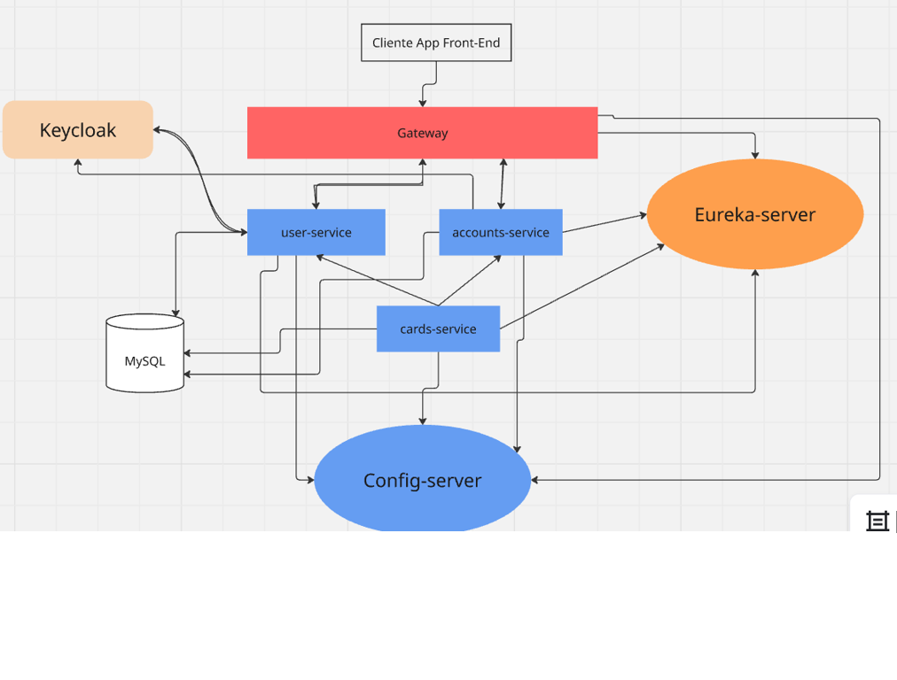

# 💼 Digital Money House - Backend Challenge

Bienvenido al desafío profesional de Backend para **Digital Money House**, una billetera virtual que permite a los usuarios gestionar su dinero de forma sencilla, segura y moderna.

---

## 🚀 Funcionalidades Principales

Esta solución incluye las siguientes funcionalidades:

- 📝 Registro de usuario  
- 💸 Transferencias de dinero mediante **alias** o **CVU**  
- ➕ Agregar dinero con tarjeta de crédito  
- 💳 Agregar tarjeta de crédito  
- ❌ Eliminar tarjeta de crédito  
- 👤 Visualización del perfil del usuario (alias y CVU)  
- 💰 Consulta de saldo  
- 🧾 Visualización de tarjetas registradas  
- 📈 Visualización de movimientos de la cuenta  

---

## 🧩 Microservicios Incluidos

Este sistema está desarrollado bajo una arquitectura de microservicios:

- 📡 `eureka-server`  
- ⚙️ `config-server`  
- 🚪 `gateway`  
- 👥 `users-service`  
- 💼 `accounts-service`  
- 💳 `cards-service`  
- 🔄 `transactions-service`

---

## 🏗️ Arquitectura y Tecnologías

- 🗃️ **Base de Datos:** MySQL  
- 🛡️ **IAM:** Keycloak para autenticación y autorización  
- 🐳 **Deploy:** Docker  
- 🔀 **Arquitectura basada en microservicios**

### 🗺️ Diagrama de Arquitectura



---

## 📬 Documentación de la API

Está disponible una colección pública de Postman para probar las APIs:

🔗 [Ver documentación en Postman](https://documenter.getpostman.com/view/6653977/2sB2x6kXUy)

---

## 🧪 Pruebas Automatizadas

Repositorio dedicado a pruebas automáticas del proyecto:

🔗 [Test Automático - Digital Money House](https://github.com/diegomiret/Test-automatico-DigitalMoneyHouse)

---

## 🖥️ Ejecución del Frontend

### Pasos para correr la aplicación:

1. Clonar el repositorio del frontend:  
   ```bash
   git clone https://github.com/diegomiret/digital-money-house-frontend
   cd digital-money-house-frontend
   npm install
   npm run dev

2. Clonar el repositorio del frontend: 
   Acceder a la aplicación desde tu navegador en:
http://localhost:3000 (puede variar según configuración local)
